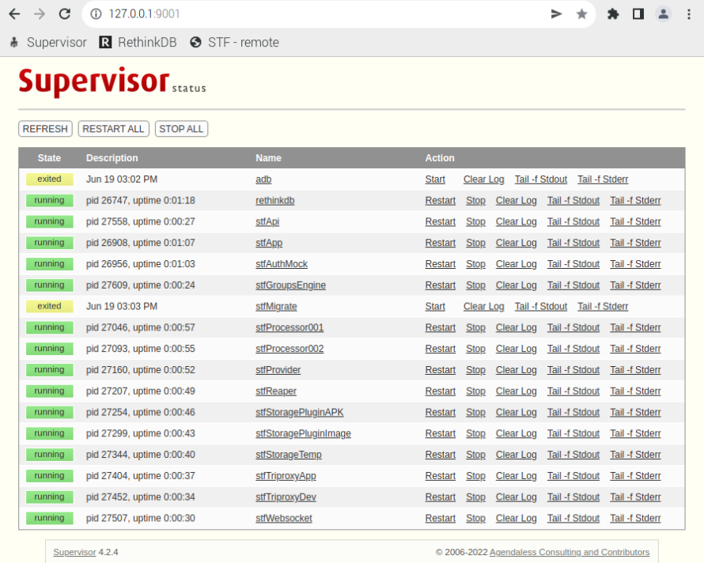

# Smartphone Test Farm - Production Deployment

This is a guide on how to setup a [production deployment of STF](https://github.com/DeviceFarmer/stf/blob/master/doc/DEPLOYMENT.md) on a Raspberry Pi. We will still use mock authentication (username & e-mail), but this setup is more reliable, secure, and easily accessible from a single public domain name. Furthermore, replacing the mock authentication component with real authentication should be straightforward.

## Requirements

### Assumptions

This guide assumes that you have already followed [STF.md](STF.md) in order to have a working `stf local` setup. Furthermore, we will assume that STF will be reachable on the hostname `s2examplestf.net`.

To get start, SSH into your Pi and fetch the necessary files from this repo:

```bash
ssh stf@<pi_address>
git clone https://github.com/S2-group/energy-experiments-utilities.git
mv energy-experiments-utilities/STF-production/sources .
rm -rf energy-experiments-utilities
```

### Installing & Configuring nginx

To install nginx, run the following command:

```bash
sudo apt install -y nginx openssl
```

Make sure that nginx has been successfully installed by running the command:

```bash
curl -i http://127.0.0.1/
```

and seeing the nginx test page in the output, with status code `HTTP/1.1 200 OK`.

Next, stop nginx and delete the current test site:

```bash
sudo service nginx stop
sudo rm -rf /etc/nginx/sites-enabled/
```

Edit the nginx configuration in sources/nginx.conf and modify the `server_name` in both servers to your public hostname (e.g. `s2examplestf.net`). Then, move the configuration file to its appropriate place:

```bash
sudo mv sources/nginx.conf /etc/nginx/nginx.conf
```

Finally, generate a self-signed X.509 certificate and/or Diffie-Hellman parameters (dhparam). If you already have a certificate and a key for your domain name, then only generate the DH parameters and make sure that you update the appropriate fields in the /etc/nginx/nginx.conf file.

```bash
# Make sure to use your public domain, e.g. `s2examplestf.net`, as the "Common Name" in the X.509 certificate
openssl req -x509 -nodes -days 365 -newkey rsa:2048 -keyout nginx-selfsigned.key -out nginx-selfsigned.crt
openssl dhparam -dsaparam -out dhparam.pem 4096

sudo mkdir /etc/nginx/ssl/
sudo mv nginx-selfsigned.crt /etc/nginx/ssl/
sudo mv nginx-selfsigned.key /etc/nginx/ssl/
sudo mv dhparam.pem /etc/nginx/ssl/
```

Now, we can start again nginx.

```bash
sudo service nginx start
```

### Installing & Configuring supervisord

We will use [supervisord](http://supervisord.org/) as a way to control all the [individuals components of STF](https://github.com/DeviceFarmer/stf/blob/master/doc/DEPLOYMENT.md#app-role). supervisord requires Python 3.4 or later.

#### pyenv (Optional - Recommended)

*If you want to rely on your system's python3 installation, or use another python version manager, feel free to skip this section.*

First, we will install [pyenv](https://github.com/pyenv/pyenv) as a Python Version Management system. To do so we will use the [pyenv-installer](https://github.com/pyenv/pyenv-installer) script:

```bash
curl https://pyenv.run | bash
```

And add the following to your `~/.bashrc` (or `~/.zshrc`, or `~/.profile` depending on your shell).

```bash
export PYENV_ROOT="$HOME/.pyenv"
command -v pyenv >/dev/null || export PATH="$PYENV_ROOT/bin:$PATH"
eval "$(pyenv init -)"
```

Now, load pyenv in your current terminal:

```bash
source ~/.bashrc
```

Verify its installation:

```bash
pyenv --version
```

which should now display `pyenv 2.3.1` (or similar).

Now, let's install the python version which we will use for supervisord and create a virtual environment for it:

```bash
sudo apt install -y bzip2 libbz2-dev libreadline8 libreadline-dev sqlite3 libsqlite3-dev lzma liblzma-dev
pyenv install 3.9.13
pyenv virtualenv 3.9.13 supervisord
```

And finally activate the just now created virtualenv:

```bash
pyenv activate supervisord
pip install --upgrade pip
```

#### Installing supervisord

To install supervisord:

```bash
pip install supervisor
```

To verify installation of supervisord:

```bash
supervisord --version
```

which should print the version of supervisord (e.g. `4.2.4`).

#### Configuring supervisord

First, we will create some necessary folders required by supervisord and STF:

```bash
mkdir logs
mkdir stf-storage-temp
```

Next, modify the sources/env-stf.inc file and update the `PUBLIC_HOSTNAME`, `STF_ADMIN_NAME`, `STF_ADMIN_EMAIL`, `STF_SESSION_SECRET`, and `STF_NODE_TLS_REJECT_UNAUTHORIZED`.

You may also optionally modify the sources/env-supervisord.inc file and update the `INET_HTTP_SERVER_USERNAME` and `INET_HTTP_SERVER_PASSWORD` fields.

### Configuring /etc/hosts

In the /etc/hosts file, append the following lines:

```txt
127.0.0.1       s2examplestf.net
127.0.0.1       appside.s2examplestf.net
127.0.0.1       devside.s2examplestf.net
```

## Running STF

Now that everything is configured, we can run STF:

```bash
sudo service nginx restart
~/sources/start-supervisord.sh
```

The last command will take a minute to complete. Upon completion, you should see:

```log
Starting supervisord
rethinkdb: started
adb: started
stfApp: started
stfAuthMock: started
stfMigrate: started
stfProcessor001: started
stfProcessor002: started
stfProvider: started
stfReaper: started
stfStoragePluginAPK: started
stfStoragePluginImage: started
stfStorageTemp: started
stfTriproxyApp: started
stfTriproxyDev: started
stfWebsocket: started
stfApi: started
stfGroupsEngine: started
```

Upon success, visiting supervisord HTTP dashboard, you should see the following output:



Now, if you visit `https://s2examplestf.net` from you Pi, the STF dashboard should be visible and you should be able to interact with phones.

## Stopping STF

To stop STF, run the following command:

```bash
~/sources/stop-supervisord.sh
```

This will stop the STF related instances, but supervisord will keep running in the background. If you also want to stop supervisord, then run:

```bash
pkill supervisord
```

## Troubleshooting

* Check out troubleshooting steps in [STF.md](STF.md)
* Check the logs of nginx: `sudo service nginx status` and files in `/var/log/nginx/`
* Check STF and rethinkdb logs for errors in `~/logs/*.log`
* If you modified `sources/supervisord.conf`, then you have to kill the supervisord instance and start it again.
* If you modified any of the configuration files of nginx in `/etc/nginx/*`, make sure to restart nginx.
