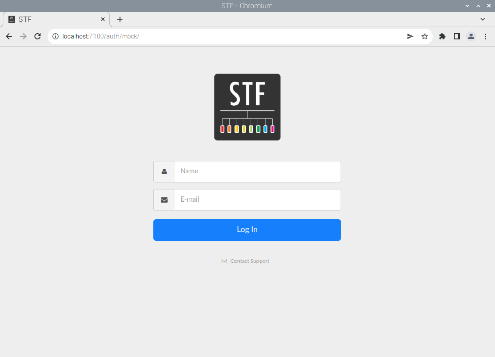

# Smartphone Test Farm

This is a simple guide to setup a local development [Smartphone Test Farm (STF)](https://github.com/DeviceFarmer/stf) on a Raspberry Pi.

## Hardware Requirements

* Raspberry Pi.
* A good quality SD card that servers as the PI's OS. This is important to speed up the installation process but most importantly to run the STF and have reasonably low latency when interacting with phones.
  * An SDXC (Speed) Class 10, UHS-1 (U1), V10 or better.
  
  * Prefer reputable quality brands, such as Kingston, Samsung, SanDisk, etc.
* A phone to test STF (e.g. LG Nexus 5X).
* A USB cable capable of both data transfers and charing, in order to connect the phone to the Pi.

If you intend to run STF with more than one phones, then a good quality USB hub from [this hardware list](https://github.com/DeviceFarmer/stf#recommended-hardware) is recommended. The hub *must* be powered externally and not by the Pi, as the phones can draw a lot of power and adb connections then will be flickery.

## Software Requirements

### Creating a new user

We will install everything under a new user, called `stf`. So, let's first create the user:

```bash
sudo useradd -m stf
sudo adduser stf sudo
sudo adduser stf plugdev

# Allow the user stf to run sudo commands with no password
echo 'stf ALL=(ALL) NOPASSWD: ALL' | sudo tee /etc/sudoers.d/010_stf-nopasswd
sudo chmod 440 /etc/sudoers.d/010_stf-nopasswd

sudo passwd stf
```

This will create a user `stf` along with a home directory at `/home/stf` with sudo privileges. The last command will set a password for the new user.

Now disconnect from SSH and connect again using the `stf` account:

```bash
ssh stf@<pi_address>
```

#### SSH key authentication (Optional)

If you already have an SSH key, we can associate it with the newly created user. To do so, type the following command on your **Host** machine:

```bash
ssh-copy-id -i ~/.ssh/<key_id>.pub stf@<pi_address>
```

Finally, connect to your PI's newly created `stf` account with your SSH key, and disable password login for this account:

```bash
ssh stf@<pi_address>
sudo passwd -l stf
```

Now disconnect from SSH and connect again.

### `apt` packages

Run the following command to install the necessary packages:

```bash
sudo apt install -y build-essential libssl-dev \
    android-sdk-platform-tools cmake graphicsmagick \
    libzmq3-dev protobuf-compiler yasm pkg-config
```

### Installing Node.js 8.x

To install this specific nodejs version, we will use [Node Version Manager (NVM)](https://github.com/nvm-sh/nvm). To install nvm, we use the following command:

```bash
curl -o- https://raw.githubusercontent.com/nvm-sh/nvm/v0.39.1/install.sh | bash
```

To immediately enable it in our current terminal, run `source ~/.bashrc` (or `~/.zshrc`, or `~/.profile` depending on your shell). To verify that nvm has been installed, run:

```bash
command -v nvm
```

which should output `nvm`. (Note that `which nvm` will **not** work, since nvm is a sourced shell function, not an executable binary.)

Finally, install the required node 8.x version:

```bash
nvm install 8
```

To verify that node 8.x installed correctly, run the following commands in your terminal:

```bash
nvm use 8 # set your terminal to use the just installed nodejs version 8
node --version
```

The final command should output `v8.17.0`.

### Installing RethinkDB

[RethinkDB](https://rethinkdb.com/) does not have an APT package for Raspbian and its support for ARM is experimental. So, we have to [build it and install it from source](https://rethinkdb.com/docs/install/raspbian/). To do so, first we install the dependencies:

```bash
sudo apt install -y g++ protobuf-compiler libprotobuf-dev \
    libboost-dev curl m4 wget libssl-dev clang
```

Next, we download and extract the source code:

```bash
wget https://download.rethinkdb.com/repository/raw/dist/rethinkdb-2.4.2.tgz
tar -xvf rethinkdb-2.4.2.tgz
```

Finally, we build the source code:

```bash
cd rethinkdb-2.4.2/
./configure --allow-fetch CXX=clang++
make
sudo make install
```

To verify the installation, run the following command:

```bash
rethinkdb --version
```

which should output `rethinkdb 2.4.2 (CLANG 11.0.1 )` or similar.

### Installing STF

Now that we have installed all dependencies, we can install STF. First we make sure that we are using the correct version of NodeJS, and then we install STF:

```bash
nvm use 8
npm install -g @devicefarmer/stf
```

## Testing STF locally

Once STF has been installed successfully, we can test it locally. To do so, we type the following commands in two separate terminals:

```bash
tty1:~ $: rethinkdb

tty2:~ $: nvm use 8
tty2:~ $: stf local
```

The `rethinkdb` will also create a "rethinkdb_data" folder, which will hold the database used by STF.

To verify that everything works correctly, open a browser in the Pi (e.g. via VNC, HDMI, or SSH with X11 forwarding) and check the following:

1. On `http://127.0.0.1:8080/` the rethinkdb dashboard should be running.
  
2. On `http://127.0.0.1:7100/` the STF interface should be running. You can login with credentials `admin:admin@fakedomain.com`
  
3. Connect a phone to the Raspberry Pi in one of its two USB 2.0 ports. If prompted on the phone to accept an RSA key, tick the "Always remember this computer" and tap yes. Now the phone should appear under the STF dashboard.
  

### Stopping STF

We first have to stop STF and then rethinkdb. So, first on tty2 hit `[CTRL+C]` to stop STF, and then on tty1 hit `[CTRL+C]` to stop STF.

## Troubleshooting

If you do not see the phone in the STF dashboard, try the following:

* Make sure that you have enabled [Developer Options and USB debugging](https://developer.android.com/studio/debug/dev-options#enable) in the phone
* Check if the phone appears under `lsusb`
* Check if the phone appears under `adb devices -l`
* Check the output of the `stf local` command for any error messages
* Check the output of the `rethinkdb` command for any error messages
* Check `dmesg` output for any "xHCI host controller not responding, assume dead" messages. ([Issue#3404](https://github.com/raspberrypi/linux/issues/3404))
* Make sure you are using a USB cable that supports both charging and data transfers.

Happy testing! :rocket: :hammer:
